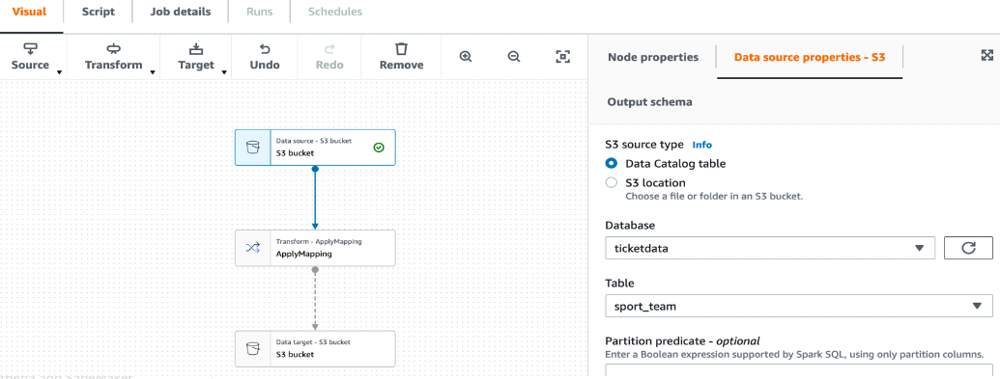
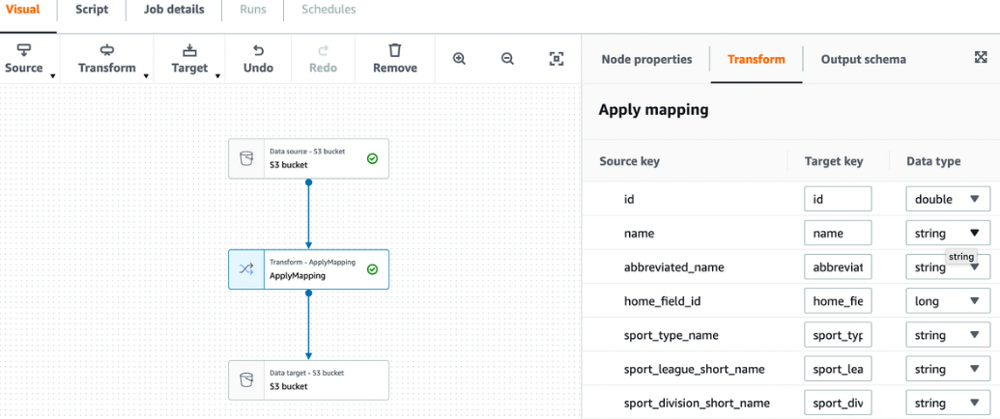
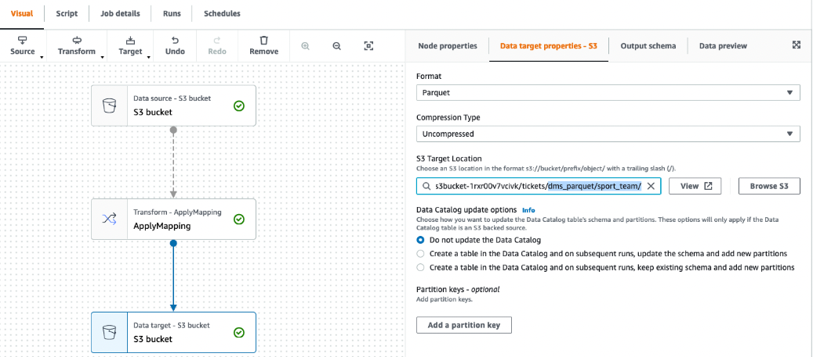
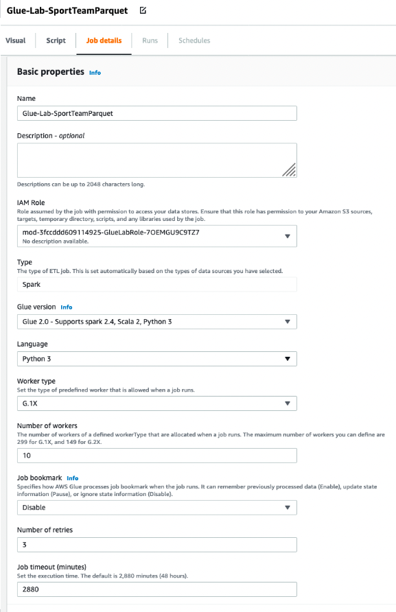
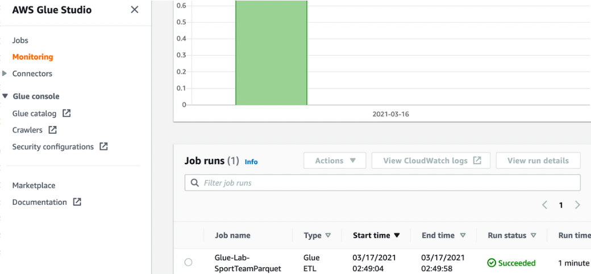
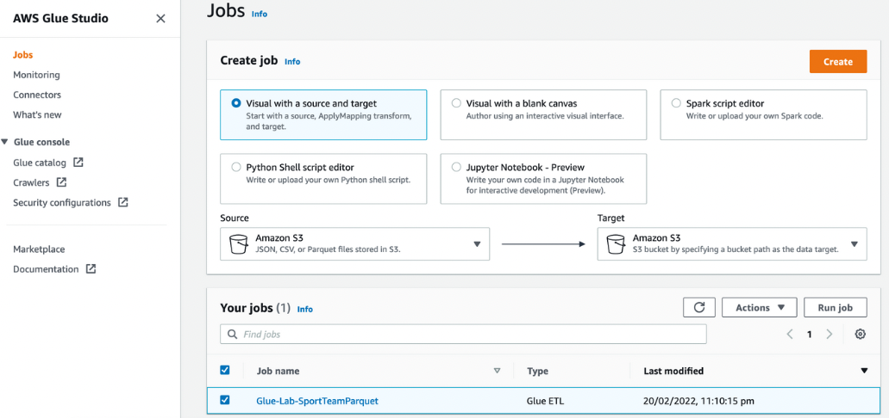

# Lab3-3: Data ETL Exercise

## PART A: Data Validation and ETL - Data ETL Exercise 
사전 조건: 처리된 데이터를 **parquet format**으로 저장하려면 각 테이블에 대한 새 폴더 위치가 필요합니다.\
예를들어 **sport_team** 테이블의 전체 경로는 다음과 같습니다.\
*`s3://<s3_bucket_name>/tickets/dms_parquet/sport_team`*

Glue는 위의 예와 같이 전체 파일 경로의 입력을 기반으로 새 폴더를 자동으로 생성합니다.\
S3 버킷에 수동으로 폴더를 생성하는 방법은 [사용 설명서](https://docs.aws.amazon.com/AmazonS3/latest/user-guide/create-folder.html)를 참조해보세요.

#### 1.왼쪽 탐색 창의 *ETL 메뉴* 에서 *AWS Glue Studio*를 클릭합니다.

#### 2. *View jobs* 을 선택해주세요.

#### 3. *Visual with a source and target* 옵션을 선택하고 *Create* 를 클릭합니다.

#### 4. 좌측 표출되는 그래프 상단에서 *Data source - S3 bucket*을 선택합니다.

#### 5. 그리고 우측 *Data source properties - S3* 패널의 Database 선택메뉴를 드롭다운하여 *`ticketdata`* 선택합니다.

#### 6. 그리고 *`sport_team`* 테이블을 선택합니다.

#### 7. 이번엔 좌측 그래프 중앙에 있는 *ApplyMapping* 노드를 선택합니다. 그리고 우측 *Transform* 패널에서 Source Key의 *id* 열의 *`Data type`*을 double로 변경합니다.

#### 8. 그래프 하단에 있는 *Data target - S3 bucket* 노드를 선택합니다. 그리고 우측 *Data target properites - S3* 패널에서 Format을 드롭다운하여 type을 Parquet으로 변경합니다. 이어서 아래의 *Compression Type*을 드롭다운 하여 Uncompressed 를 선택합니다.
#### 9. *S3 Target Location*에서 *Browse S3*를 선택하고 *`mod-xxx-dmslabs3bucket-xxx`* 버킷을 찾아 tickets 폴더를 선택하고 Choose 를 눌러주세요.

#### 10. 앞서 선택된 S3버킷 path가 입력된 곳에서 추가적으로 *`dms_parquet/sport_team/`* 을 S3 URL에 추가합니다. 
경로는 *`s3://mod-xxx-dmslabs3bucket-xxx/tickets/dms_parquet/sport_team/`* 형태와 유사해야 합니다. Path의 끝부분에 `/`를 잊지 마세요.

#### 11. 마지막으로 좌측 상단의 메인 탭에서 3번째 *Job details* 를 선택합니다. Name에는 *`Glue-Lab-SportTeamParquet`* 을 입력합니다.
#### 12. *IAM Role* 은 *`mod-xxx-GlueLabRole-xxx`* 와 유사한 이름의 역할을 선택합니다.
#### 13. 페이지를 아래로 스크롤해서 *Job bookmark*를 드롭다운하여 *Disable* 선택합니다. 이 Lab의 뒷부분에서 *Job bookmark* 기능을 사용해 볼 수 있습니다.

#### 14. 오른쪽 상단 모서리에 있는 *Save* 버튼을 눌러 Job을 생성합니다.
#### 15. 배너에 *Successfully created job* 메시지가 표시되면 *Run* 버튼을 클릭하여 *Job* 을 시작합니다.
#### 16. 왼쪽 탐색 패널에서 *Jobs* 선택하여 *Job* 목록을 확인합니다.
#### 17. 실행 중인 jobs, success/failure rates 및 기타 다양한 statistics를 보려면 왼쪽 탐색 패널에서 *Monitoring* 선택합니다.

#### 18. *Job runs* 목록을 아래로 스크롤하여 ETL Job이 성공적으로 완료되었는지 확인합니다. 완료하는 데는 약 1분이 소요됩니다.

#### 19. *sport_location, sporting_event, sporting_event_ticket 및 person* 테이블을 변환하기 위해 추가 4개의 Job에 대해 이 프로세스를 반복해야 합니다.
우리는 이 프로세스 수행하는 동안 다른 column data types을 수정해야 합니다. 
각 table에 대해 위의 프로세스를 반복하거나 첫 번째 작업을 복제하고 세부 정보를 업데이트할 수 있습니다. 
아래 단계에서는 작업을 복제하는 방법을 설명합니다. 
만약 매번 수동으로 생성하는 경우에는 위 단계를 따르되 아래 표에서 업데이트된 값을 사용해야 합니다. 

  a. Jobs 메뉴로 돌아가서 아까 생성된 *Glue-Lab-SportsTeamParquet*의 Check box를 선택하고 우측 상단 메뉴에서 Actions > Clone job을 수행합니다. 
  b. 그리고 Save and Run을 선택해 줍니다.      

 19-1. Sport_Location:(아래의 attributes를 사용해서 *Glue-Lab-SportLocationParquet* 작업을 생성합니다.)
|Task / Action|Attribute|Values|
|------|---|---|
|“Data source - S3 bucket” node|Database|`ticketdata`|
||Table|`sport_location`|
|“Transform - ApplyMapping” node|Schema transformations|None|
|“Data target - S3 bucket” node|Format|Parquet|
||Compression Type|Uncompressed|
||S3 target path|`tickets/dms_parquet/sport_location/`|
|“Job details tab”|Job Name|`Glue-Lab-SportLocationParquet`|
||IAM Role|xxx-GlueLabRole-xxx|
||Job bookmark|Disable|

  19-2. Sporting_Event:(아래의 attributes를 사용해서 *Glue-Lab-SportingEventParquet* 작업을 생성합니다.)
|Task / Action|Attribute|Values|
|------|---|---|
|“Data source - S3 bucket” node|Database|`ticketdata`|
||Table|`sporting_event`|
|“Transform - ApplyMapping” node|Schema transformations|column “start_date_time” => TIMESTAMP|
|||column “start_date” => DATE|
|“Data target - S3 bucket” node|Format|Parquet|
||Compression Type|Uncompressed|
||S3 target path|`tickets/dms_parquet/sporting_event/`|
|“Job details tab”|Job Name|`Glue-Lab-SportingEventParquet`|
||IAM Role|xxx-GlueLabRole-xxx|
||Job bookmark|Disable|
 
  19-3. Sporting_Event_Ticket:(아래의 attributes를 사용해서 *Glue-Lab-SportingEventTicketParquet* 작업을 생성합니다.)
|Task / Action|Attribute|Values|
|------|---|---|
|“Data source - S3 bucket” node|Database|`ticketdata`|
||Table|`sporting_event_ticket`|
|“Transform - ApplyMapping” node|Schema transformations|column “id” => DOUBLE|
|||column “sporting_event_id” => DOUBLE|
|||column “ticketholder_id” => DOUBLE|
|“Data target - S3 bucket” node|Format|Parquet|
||Compression Type|Uncompressed|
||S3 target path|`tickets/dms_parquet/sporting_event_ticket/`|
|“Job details tab”|Job Name|`Glue-Lab-SportingEventTicketParquet`|
||IAM Role|xxx-GlueLabRole-xxx|
||Job bookmark|Disable|

  19-4. Person:(아래의 attributes를 사용해서 *Glue-Lab-PersonParquet* 작업을 생성합니다.)
|Task / Action|Attribute|Values|
|------|---|---|
|“Data source - S3 bucket” node|Database|`ticketdata`|
||Table|`person`|
|“Transform - ApplyMapping” node|Schema transformations|column “id” => DOUBLE|
|“Data target - S3 bucket” node|Format|Parquet|
||Compression Type|Uncompressed|
||S3 target path|`tickets/dms_parquet/person/`|
|“Job details tab”|Job Name|`Glue-Lab-PersonParquet`|
||IAM Role|xxx-GlueLabRole-xxx|
||Job bookmark|Disable|

이렇게 Glue Job을 4번을 반복하여 *sport_team, sport_location, sporting_event, sporting_event_ticket 및 person* 총 5개의 테이블에 대해 CSV에서 Parquet 형태로 변경하여 저장했습니다. 
이제 아래를 클릭하시어, 변경된 *Parquet Table*을 *Glue Crawler*를 통해 *Data Catalog*로 생성해 보는 마지막 Lab으로 이동합니다.  
[3-4.Data Validation and ETL - Create Glue Crawler for Parquet Files](../detail/3-4.CreateGlueCrawlerforParquetFiles.md)
