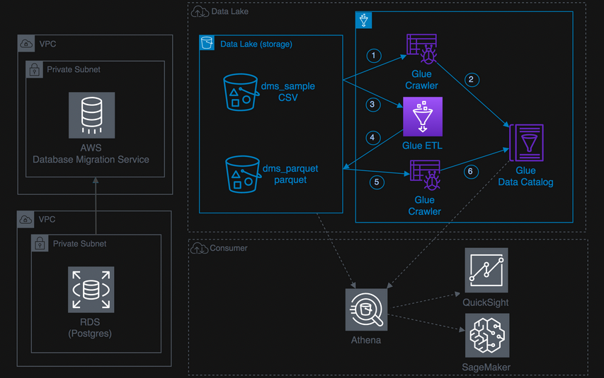
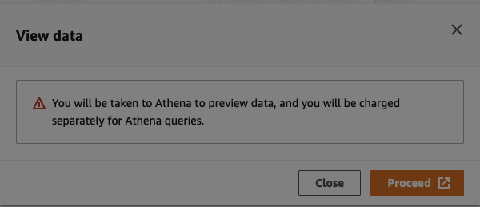
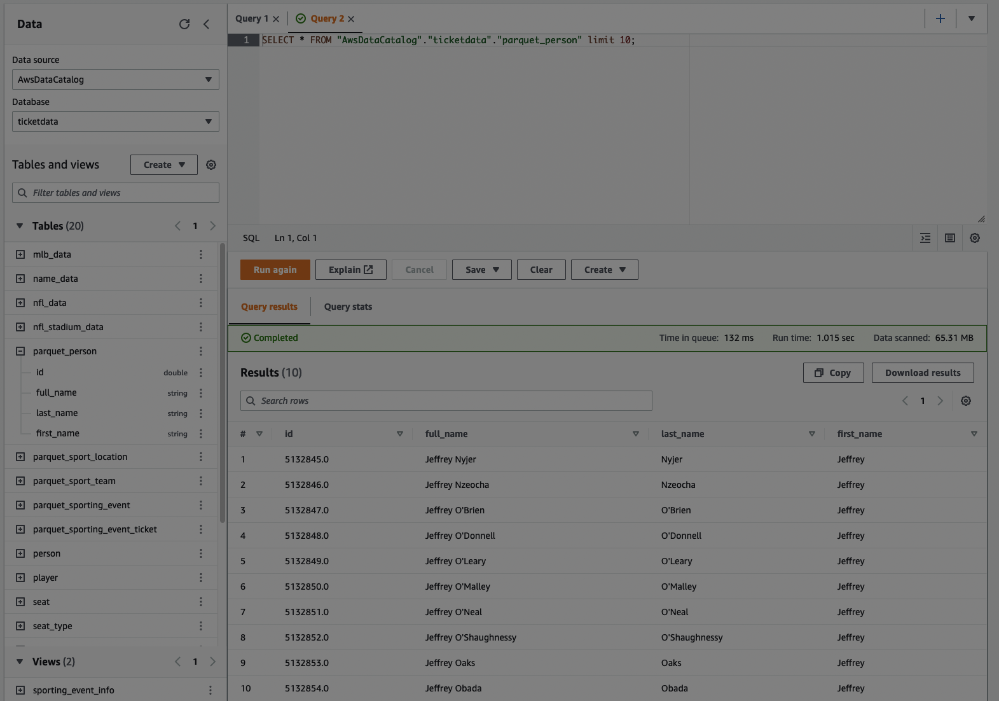
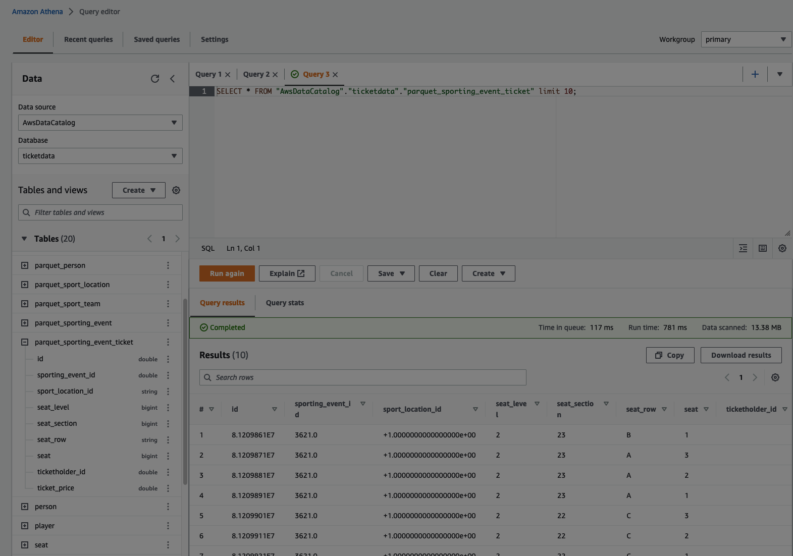

# Lab3-4: Create Glue Crawler for Parquet Files

이번 단계에서는 아래 Architecture에서 5,6번에 해당되는 Glue의 마지막 작업을 실습해 봅니다.\

#### 1.왼쪽 탐색 창의 *ETL 메뉴* 에서 *AWS Glue Studio*를 클릭합니다.

#### 2. *View jobs* 을 선택해주세요.

#### 3. *Visual with a source and target* 옵션을 선택하고 *Create* 를 클릭합니다.

다음 검증 작업을 통해 우리가 작업한 parquet 테이블들이 올바르게 생성했는지 확인합니다.  

왼쪽 탐색 창에서 *Databases > Tables* 클릭하여, 검색창에 다음과 같은 Filter를 사용하여 새로만든 parquet Table들을 확인해 봅니다. 
검색창: `Database = ticketdata`, `Classification = parquet`
아래와 같이 앞 단계에서 생성한 5 개의 parquet 테이블 목록을 확인할 수 있습니다.

<Optional> 이어서 5개의 parquet table들이 각각 컬럼 속성이 맞게 변환되었는지 확인하기 위해서 
테이블 목록 우측의 *View data* 항목의 *Table data*를 클릭하면  *Athena Query*를 통해 바로 테이블 속성과 데이터를 쿼리한 결과를 볼수 있습니다.

각 테이블의 'View data' 항목의 'Table data'를 클릭하고  view 창에서 proceed 버튼을 클릭합니다.

예시와 같이 parquet_person의 실제 데이터 쿼리에 대한 결과를 확인할 수 있으며 핸즈온 가이드에서
변환해야하는 컬럼 속성들이 맞게 변환되었는지 비교해야 합니다. 

  
만약 속성들이 맞게 변환되지 않은 경우 *Glue Studio > Job* 에서 앞서 생성한 job을 삭제하고 재 생성하거나 *잘못 생성 된 Job선택(체크박스) > Action > Edit Job*을 통해 속성을 맞게 변환 후 Job을 저장하세요.
그리고 반드시 *Run* 을 다시 시작해야 합니다.
