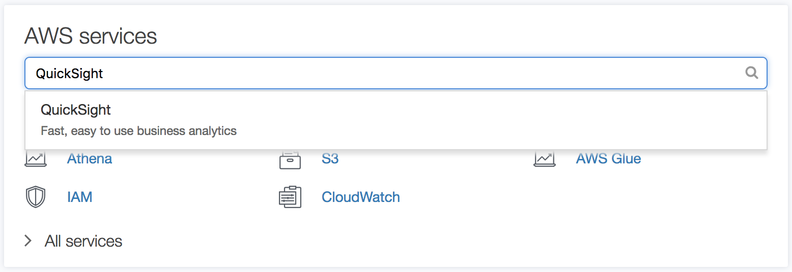
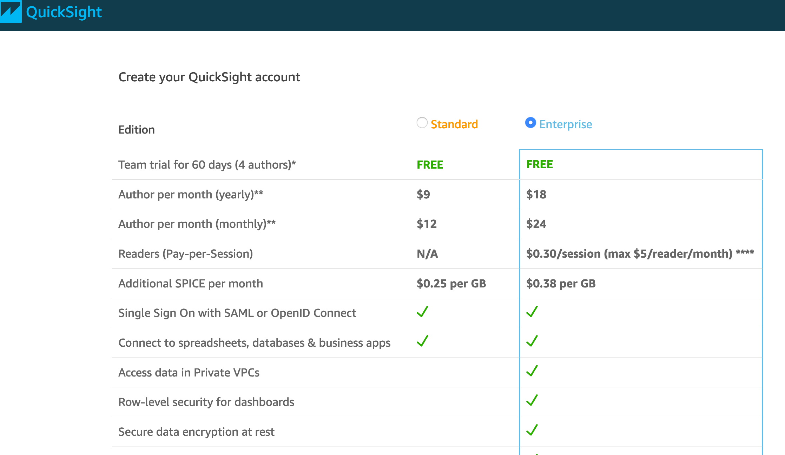
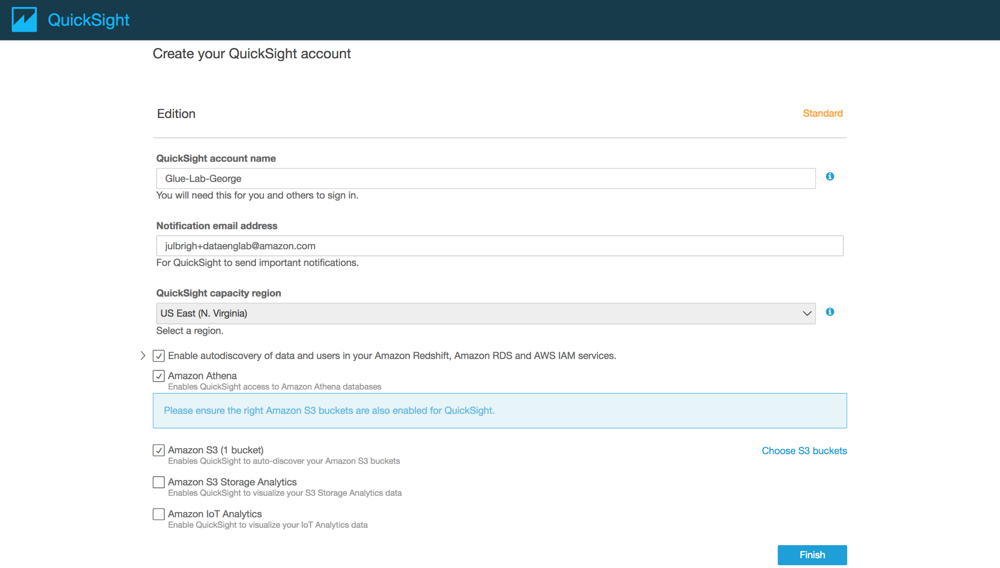
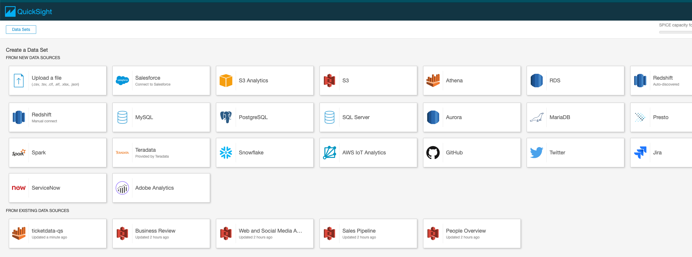
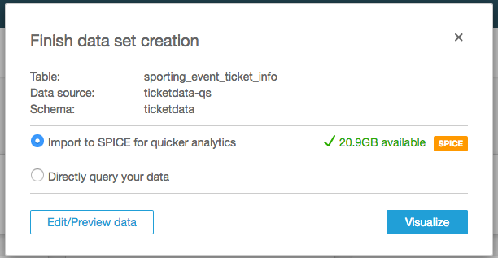
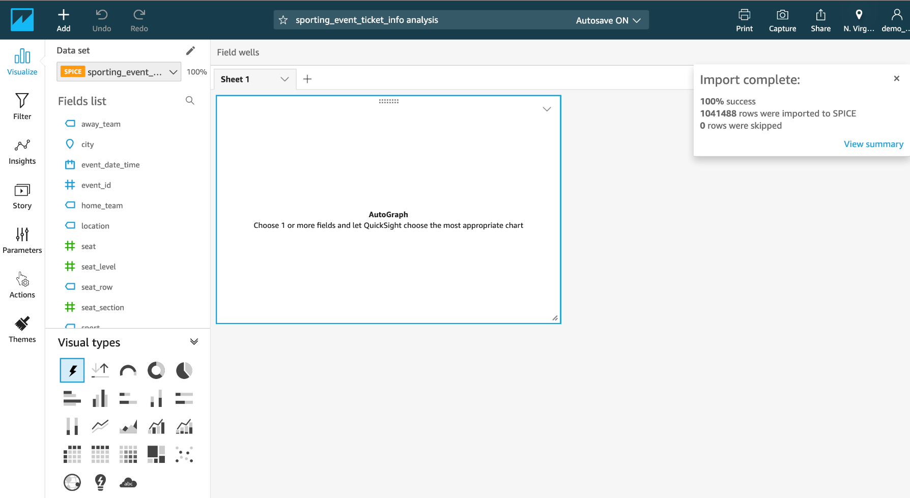

# Lab: QuickSight 대시보드 만들기

## QuickSight 세팅
1. AWS 콘솔창에서 QuickSight 검색
  
QuickSight 사용이 처음이면, 계정 생성 절차가 실행되니 완료해 주십시오.  
2. <b>Sign up for QuickSight</b> 클릭  

3. account type은 <b>Enterprise</b> 선택  
4. <b> Continue </b>선택

5. <b>Create your QuickSight account</b> 페이지에서, QuickSight account name에는 unique한 이름(e.g., quicksight-lab-<initials>-<randomstring>)과 이메일을 입력해야 합니다.  
6. 사용중인 AWS 리전을 선택하고 <b>auto discovery, Amazon Athena, Amazon S3</b>를 활성화하도록 체크박스 선택  
7. DMS 버킷(e.g., <b>"xxx-dmslabs3bucket-xxx"</b>)선택 후 <b>Finish</b> 클릭  

  
8. 상단 오른쪽에 <b>New analysis</b> 클릭  

  
9. <b>New Data Set</b> 클릭  

  
10. <b>Create a Dataset</b>페이지에서 Data source로 <b>Athena</b> 선택  

11. Data source name : <b>ticketdata-qs</b> 입력 후, <b>Validate connection</b> 클릭
12. <b>Create data source</b> 클릭  
  
13. Database 드롭다운 리스트에서 <b>ticketdata</b> 선택
14. <b>sporting_event_ticket_info</b> 테이블 선택 후, <b>Select</b> 클릭  

  
15. <b>Import to SPICE for quicker analytics</b>옵션 선택 후 <b>Visualize</b> 클릭
만약 사용 가능한 SPICE 용량이 없다면 <b>Directly query your data</b> 선택  

  
### 드디어 여러분의 대시보드를 만들 수 있는 QuickSight Visualize interface를 확인할 수 있습니다!!!

